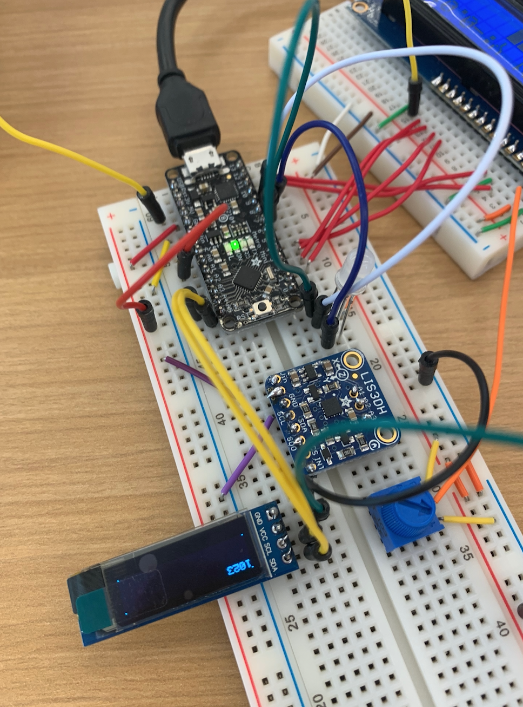

# Light It Up

## Overview

For this assignment, you are going to

A\) [Set up a breadboard](lab-01.md#part-a-set-up-a-breadboard)

B\) [Manually blink a LED](lab-01.md#part-b-manually-blink-a-led)

C\) [Blink a LED using the Arduino](lab-01.md#part-c-blink-a-led-using-arduino)

D\) [Manually fade a LED](lab-01.md#part-d-manually-fade-a-led)

E\) [Fade a LED using Arduino](lab-01.md#part-e-fade-a-led-using-arduino)

F\) [Frankenlight](lab-01.md#part-f-frankenlight)

## In The Report

Include your responses to the bold questions on your own fork of [this lab report template](https://github.com/FAR-Lab/IDD-Fa18-Lab1). Include snippets of code that explain what you did. Deliverables are due next Tuesday. Post your lab reports as README.md pages on your GitHub, and post a link to that on your main class hub page.

## Part A. Set Up a Breadboard

For this lab, we'll be using the [Adafruit Metro Mini](https://www.adafruit.com/product/2590) development board as our hardware platform. This board is a derivative of the [Arduino UNO R3](https://store.arduino.cc/usa/arduino-uno-rev3).

You should have already have installed the [Arduino software](http://arduino.cc/en/Main/Software) on your laptop.

Wire the power rails of your breadboard so that the red rails are connected to the +5V pin of the Metro Mini, and the blue or black rails are connected to the GND pin.

## Part B. Manually Blink a LED

**a. What color stripes are on a 100 Ohm resistor?** Brown - 1 Black - 0 Brown - Multiplier \(x10\)

Thus 10 X 10 = 100 Ohm Resistor

A typical pushbutton, when pressed, connects the 2 pins on one side to the 2 pins on the other side. **a. What color stripes are on a 100 Ohm resistor?**

Connect the Metro Mini to your computer using the USB cable. The green LED on top of the Arduino should light.

Does your LED light? Why not? What do you have to do to light the LED?

**b. What do you have to do to light your LED?** The LED does not light, you have to press the button \(complete the circuit\) for the LED to light.

## Part C. Blink a LED using Arduino

### 1. Blink the on-board LED

Arduino boards typically come preloaded with a version of the Blink program on it. This code lets its L LED \(connected on pin 13\) blink as soon as the USB cable starts powering the board. Let us modify that program.

Launch the Arduino application on your computer. It will open to the template of a new empty sketch. Here is what it looks like:

Check out the Blink example code: [File-&gt;Examples-&gt;Basics-&gt;Blink](https://www.arduino.cc/en/Tutorial/Blink).

**a. What line\(s\) of code do you need to change to make the LED blink \(like, at all\)?**

You need lines 1 and 3  of the `loop`function to make the LED blink \(one to turn the LED on, and one to turn the LED off\). 

**b. What line\(s\) of code do you need to change to change the rate of blinking?**

You can change lines 2 and 4 of the `loop`function to make the LED change the rate of blinking. Changing either one of them would be sufficient as well, although both would make the blink rate more even.

**c. What circuit element would you want to add to protect the board and external LED?**

A resistor, which will allow us to limit the flow of current. If too much current flows through the circuit, various electrical components \(including the LED\) can be destroyed.  

**d. Change the `delay` parameter to modify blink rate of your LED to make it blink faster. At what delay can you no longer** _**perceive**_ **the LED blinking? \(And how can you prove to yourself that it is, in fact, still blinking?**

At 13 milliseconds, I can no longer perceive the LED blinking. 

If I wanted to prove to myself the LED was actually blinking, I could include some sort of counter, and some logical operand where every time the counter hits a multiple of 50, it blinks the LED at a visible rate. 

**e. Modify the code to make your LED blink** _**your way**_**. Save your new blink code to your lab 1 repository, with a link on the README.md.**

### 2. Blink your LED

Now modify the circuit and program so that you can blink an external LED on pin 9.

**Make a video of your LED blinking, and add it to your lab submission.**

**Video:** [**https://youtu.be/ZuvYIkpgkp0**](https://youtu.be/ZuvYIkpgkp0)\*\*\*\*

## Part D. Manually fade a LED

Set up the following circuit, and try making the LED glow brighter and dimmer.

**a. Are you able to get the LED to glow the whole turning range of the potentiometer? Why or why not?**

## Part E. Fade a LED using Arduino

The Arduino cannot output an analog voltage, only 0 or 5Vs. So how can we fade an LED using the Arduino?

The fading light is done using pulse width modulation, or PWM. The LED is toggled on and off very quickly: say, 1,000 times per second. Much faster than your eye can follow.

The percentage of time that the LED is on \(called the duty cycle\) controls its apparent brightness.

Update your circuit so the jumper wire connects to pin 11. \(To control an LED using PWM, you have to connect it to one of the pins that supports PWM \(not all do!\).

Here's a [hint diagram](https://github.com/FAR-Lab/Developing-and-Designing-Interactive-Devices/blob/docs/arduino_led_fade.png) if you need it.

On your computer, in the Arduino IDE, open the Fade sketch \(File &gt; Examples &gt; 01.Basics &gt; Fade \).

Look at the code.

**a. What do you have to modify to make the code control the circuit you've built on your breadboard?**

**b. What is analogWrite\(\)? How is that different than digitalWrite\(\)?**

Now upload your sketch and check that the LED fades on and off. Try changing a few parameters to make your own funky lighting pattern.

## Part F. FRANKENLIGHT!!!

For this part of lab, you get to hack apart an existing electronic device.

### 1. Take apart your electronic device, and draw a schematic of what is inside.

**a. Is there computation in your device? Where is it? What do you think is happening inside the "computer?"**

**b. Are there sensors on your device? How do they work? How is the sensed information conveyed to other portions of the device?**

**c. How is the device powered? Is there any transformation or regulation of the power? How is that done? What voltages are used throughout the system?**

**d. Is information stored in your device? Where? How?**

### 2. Using your schematic, figure out where a good point would be to hijack your device and implant an LED.

\(Alternately, you can hijack a light or other display on the device using an extra button.\)

### 3. Build your light!

We have perfboards in the lab, which provide a handy way to connect your parts. You may want to make your light using passive components \(such as switches, resistors or potentiometers\) rather than your microcontroller \(also known as a μC\), unless you think of a nice way to incorporate the μC into your design without soldering it inside of a light. \(You'll need it back for future labs and projects!\) If your design does require a μC, perhaps you can run a lead from your breadboard to the main light, although you'll lose portability that way. Clever use of components is encouraged!

**Make a video showing off your Frankenlight.**

**Include any schematics or photos in your lab write-up.**

The best Frankenlight will win course-wide fame and glory.

_Super awesome circuit schematics by_ [_David Sirkin_](https://me.stanford.edu/people/david-sirkin)_. Thanks David!_

